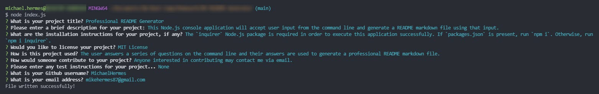

# Professional README Generator

## Description

This Node.js console application will accept user input from the command line and generate a README markdown file using that input.

## Table of Contents

- [Installation](#installation)
- [Usage](#usage)
- [License](#license)
- [How to Contribute](#how-to-contribute)
- [Tests](#tests)
- [Questions](#questions)

## Installation

The 'inquirer' Node.js package is required in order to execute this application successfully. If `packages.json` is present, run `npm i`. Otherwise, run `npm i inquirer`.

## Usage

The user answers a series of questions on the command line and their answers are used to generate a professional README markdown file.

## License

This application is covered under the MIT license. Information about this license can be found [here](http://choosealicense.com/licenses/mit/).

## How to Contribute

Anyone interested in contributing may contact me via email.

## Tests

None

## Questions?

Find me on [Github](https://github.com/michaelhermes) or email me at [mikehermes87@gmail.com](mailto:mikehermes87@gmail.com).
